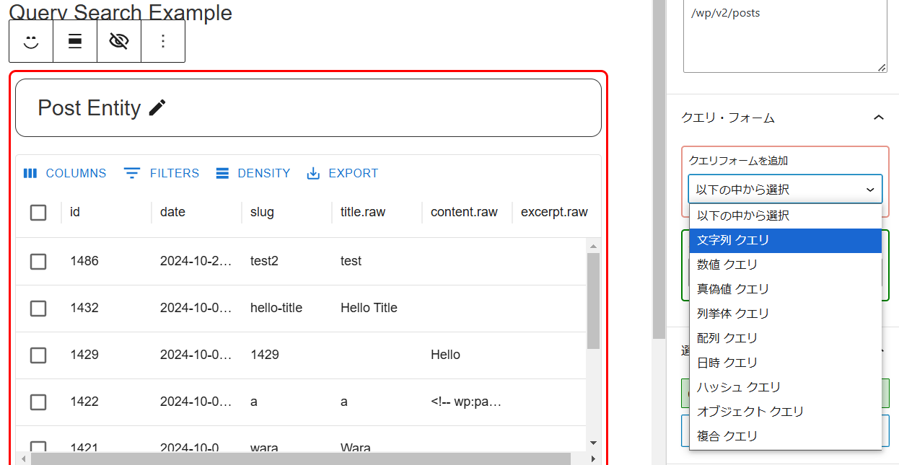

REST API のクエリ結果確認用です。
GutenbergのEntity Dataを使用し結果をデータグリッドに表示します。

このプラグインは「非公開の投稿orページ」でのみ使用してください。
開発練習用に作ったもので開発者専用となってます。


例として「投稿」にクエリを投げてみます。
以下は使い方です。


## 結果ビュー

まずは「結果ビュー(query-search/result-view)」を追加します。
REST API 結果をDataGrid表示するブロックです。


結果ビューの表示名(適当でいい)を付けます。


次にエンティティを選びます。
「投稿」は`postType`で`post`です。


## エンティティ

エンティティは「kind」と「name」からなります。
一般的なのは以下の通りです(他にもありますが省略します)。

| entity     | kind     | name        |
|------------|----------|-------------|
| 投稿       | postType | post        |
| 固定ページ | postType | page        |
| メディア   | postType | attachement |
| カテゴリ   | taxonomy | category    |
| タグ       | taxonomy | post_tag    |


エンティティを選択すると、DataGridに一覧が表示されます。


REST APIの結果から表示するカラムを選択できます。
「エンティティ決定」ボタンを押せば完了です。


## クエリ・フォーム

クエリフォームを使うとクエリを追加することができます。

    /wp/v2/posts?search=kurage

例えばテキスト検索する場合は「search」を追加します。
詳しくは公式ドキュメントを読んでください。

https://developer.wordpress.org/rest-api/reference/posts/

以下のようにクエリフォームを追加します。
「文字列 クエリ」を選択し、
「追加」ボタンを押します。




そしたら「文字列 クエリ」の入力ブロックが追加されます。
クエリパラメータの名前(フィールド名)の「search」を入力して決定ボタンをおします。


パラメータの値を入力します。「kurage」を入力します。


これでクエリパラメータが完成します。

    search=kurage

ただそのままではフィルターでは無効になっています。


フィルター(search: kurage)をチェックします。


チェックを入れると以下のURLが完成します。

    /wp/v2/posts?search=kurage


**結果ビューに即反映されます**

重要なことなのでもう一度書きます。

**結果ビューに即反映されます**

今回は「文字列」を指定するクエリフォームを使いましたが、他に「DateTime」や「配列」もあります。

DateTimeは「after」や「before」に使用します。
配列は「categories」や「include」「exclude」に使います。

これら「after, before, include, exclude」などはクエリパラメータとして使えるものです。
しかし、いちいちドキュメントを見るのも面倒です。
そこでエンドポイントを活用します。


## エンドポイントからの追加


これらクリエパラメータの情報はHTTPメソッドを「OPTIONS」に指定することで得ることができます。

```js
await wp.apiFetch({ path: '/wp/v2/posts', method: 'OPTIONS' })
```


このJSONスキーマを解析し、自動的にクエリフォームを構築するのがこの機能です。
試しに「after」を追加します。


「追加」ボタンを押すとDateTime型のクエリフォームが追加されます。
その際フィールド名(after)も設定された状態になります。


時刻を設定し、フィルターをチェックするとクエリパラメータにafterか追加されます。


## 隠し内部ブロック

これらクエリフォームの正体はブロックです。
これらは「結果ビューブロック」の隠しブロックに自動的に追加されます。

ツールバーの目のボタンを押すと「表示」「非表示」を切り替えることができます。


そしてインスペクターのフォームと連動してます。


## クエリ フォーム ブロック

直接ブロックとして追加することもできます。
「文字列 クエリ」 を追加してみましょう。


クエリ名を入力(search)


クエリフォームは結果ビューに属します。
どの結果ビューにも属してないと警告が出ます。
属する結果ビューを選択します。


クエリフォームが完成しました。


ただクエリ名(search)が二つ存在してます。
こちらのほうには値(hello)を入力します。


クエリ フィルタを見ると、「search」がラジオボタンになっています。
同じクエリパラメータの名前が複数あると、そのうちどれかを選ぶ必要があります。
searchの値「kurage」と「hello」を切り分ることができます。


## IDチェック

クエリパラメータの「categories」は、カテゴリを絞る検索です。
指定したカテゴリに属する投稿だけを検索します。

投稿のカテゴリの指定の仕方は２通りあります。


* カテゴリIDの配列を指定(categories)
* オブジェクトで指定(terms, include_children, operator)

設定の仕方はちょっと特殊です。


新たに結果ビューを追加します。
エンティティは「カテゴリ(taxonomy/category)」です。


DataGridにカテゴリ一覧が表示されます。
それぞれチェックできるので、適当にチェックします。


## マルチ クエリ

投稿の結果ビューに戻ります。
エンドポイントから「categories」を追加します。


選択項目があります。
「配列 クエリ」と「オブジェクト クエリ」です。


* 配列 クエリ


* オブジェクト クエリ


まずは「配列 クエリ」についてです。
「結果ビューから取得」ボタンを押します。


カテゴリ 結果ビューを選択します。


リストを上書きします。


クエリ フィルタを見るとチェック項目がクエリパラメータに指定されていることが確認できます。


結果ビューを見ると、特定のカテゴリに属する投稿に絞り込まれています。
わかりやすいようにカテゴリＩＤのカラムを追加しています。


ちなみに「オブジェクト クエリ」はもっと複雑です。

* terms タームのリスト(未確認だがカテゴリ以外のタームも含むのかも？)
* include_children 子タームも含めるか
* operator すべてのタームに属するなら「AND」、一部なら「OR」

これらをまとめて設定できます。
クエリパラメーターはとても複雑になってます。


## メタチェック

スキーマ(kurage_meta_includes)で投稿にメタが設定されているか調べます。


またメタがいくつそろっているかを調べます。

not: 一つもメタが含まれない
all: すべてのメタが含まれる
some: それらの間。

例えば３つのメタがあると、
not: 0
all: 3
some: 1, 2


この例では座標の値 lat, lng　があります。

`none`は座標が一切設定されていない投稿を、
`all`は両方設定されている投稿、
`some`は片方だけ設定されている投稿を
それぞれ「OR」の条件で取得します。

## その他

インスペクターから「隠しブロックへ移動」ボタンを押すことで移動できます。


結果ビューのボーダーの色や高さを変更できます


## 開発中で使用非推奨なもの

開発中の機能は無効になってます。
以下のボタンをクリックするとその機能が使えます。


アイコンの意味は、

ページや編集ページへのリンクへ移動、または編集や削除ができます。


こちらもJSONスキーマを解析することで編集フォームを自動的に作成してます。

プラスのアイコンを押すと投稿(Entity)の「新規追加」ができます。


ペンのアイコンを押すと投稿(Entity)の「更新」ができます。


これらは開発中なので動作は不安定です。


