For checking REST API query results.
Display the results in a data grid using Gutenberg's Entity Data.

Please use this plugin only on "private posts or pages".
It was created for development practice and is exclusively for developers.


As an example, let's query "posts".
Below is how to use it.


## Result View

First, add "result view (query-search/result-view)".
A block that displays REST API results in a DataGrid.


Give the result view a display name (any name you like).

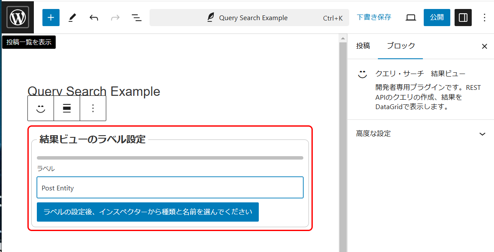


Next, select an entity.
"Post" is `postType` and is `post`.

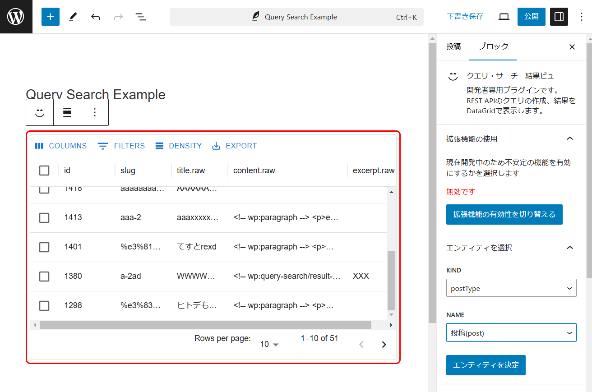


## Entity

An entity consists of a "kind" and a "name".
The common ones are as follows (there are others, but I will omit them).

| entity | kind | name |
|------------|----------|-------------|
| Post | postType | post |
| Fixed page | postType | page |
| media | postType | attachment |
| category | taxonomy | category |
| tag | taxonomy | post_tag |


Select an entity and a list will be displayed in the DataGrid.

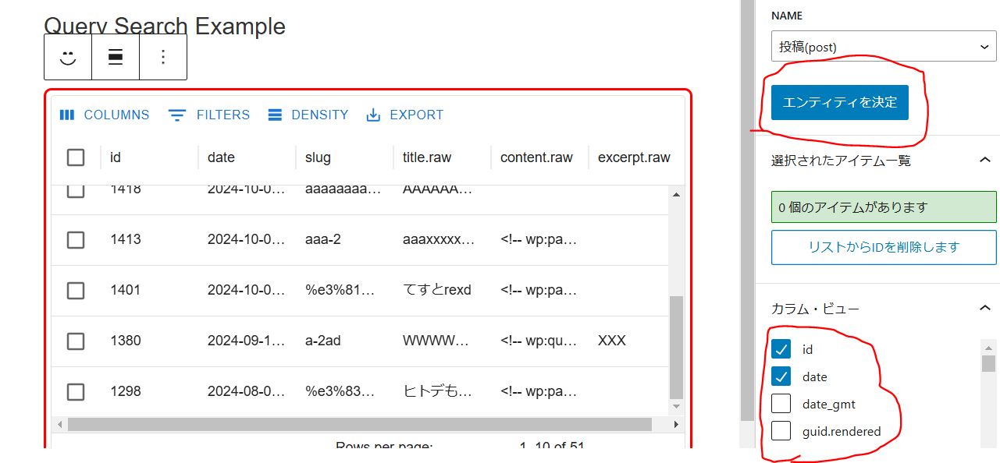

You can select columns to display from the REST API results.
Click the "Determine Entity" button to complete.


## Query Form

You can add queries using the query form.

    /wp/v2/posts?search=kurage

For example, if you want to search for text, add "search".
Please read the official documentation for more details.

https://developer.wordpress.org/rest-api/reference/posts/

Add a query form as below.
Select "String query"
Press the "Add" button.


Then, a "String Query" input block will be added.
Enter "search" for the query parameter name (field name) and press the OK button.


Enter values ​​for the parameters. Enter "kurage".


The query parameters are now complete.

    search=kurage


However, as it is, it is disabled in the filter.


Check the filter (search: kurage).

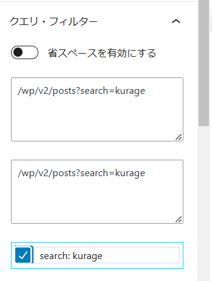


When checked, the following URL will be completed.

    /wp/v2/posts?search=kurage


**Immediately reflected in the result view**

I'll write it again because it's important.

**Immediately reflected in the result view**

This time I used a query form that specifies a "string", but there are also "DateTime" and "array" options.

DateTime is used for "after" and "before".
Arrays are used for "categories", "include" and "exclude".

These "after, before, include, exclude" etc. can be used as query parameters.
However, it is a pain to read the documents one by one.
That's where we use endpoints.


## Add from endpoint


Information on these client parameters can be obtained by specifying the HTTP method in "OPTIONS".

```js
await wp.apiFetch({ path: '/wp/v2/posts', method: 'OPTIONS' })
```


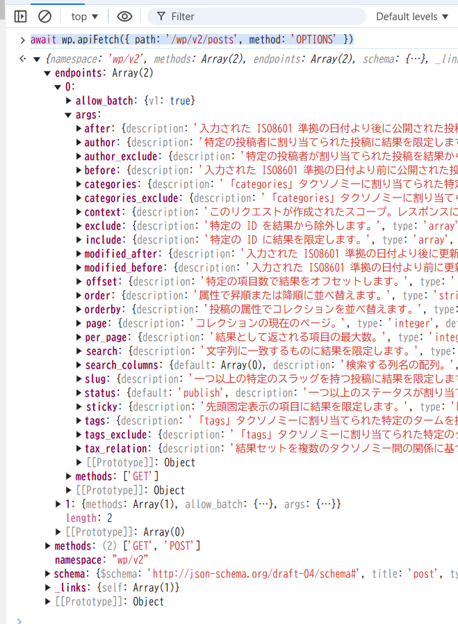

This function parses this JSON schema and automatically builds a query form.
Let's try adding "after".


Click the "Add" button to add a DateTime type query form.
At that time, the field name (after) will also be set.

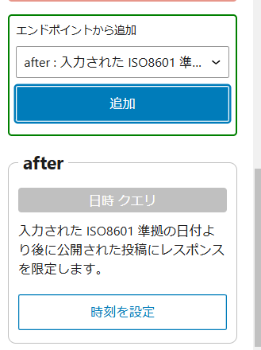


If you set the time and check the filter, after will be added to the query parameters.


## Hidden internal block

These query forms are actually blocks.
These are automatically added to a hidden block in the "Results View Block".

You can switch between "display" and "hide" by pressing the eye button on the toolbar.


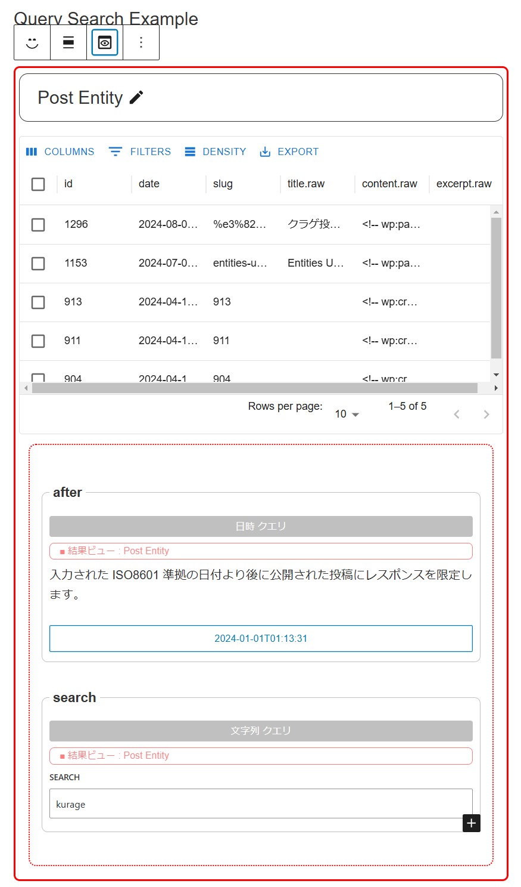

And it is linked with the inspector form.


## Query form block

You can also add it directly as a block.
Let's add a "string query".

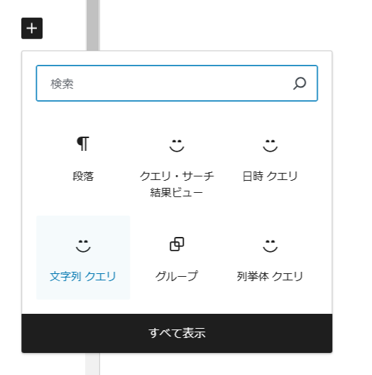


Enter query name (search)

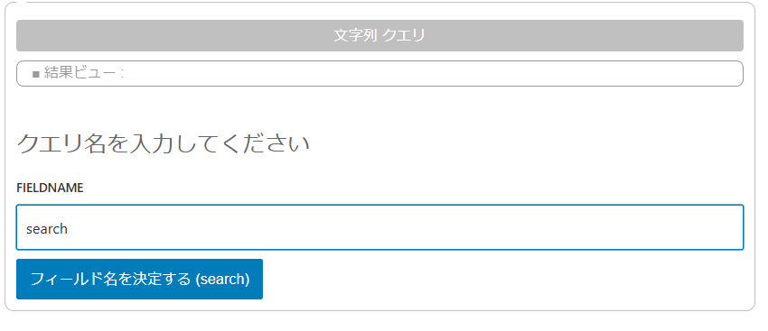


The query form belongs to the results view.
You will receive a warning if it does not belong to any result view.
Select the results view to which it belongs.

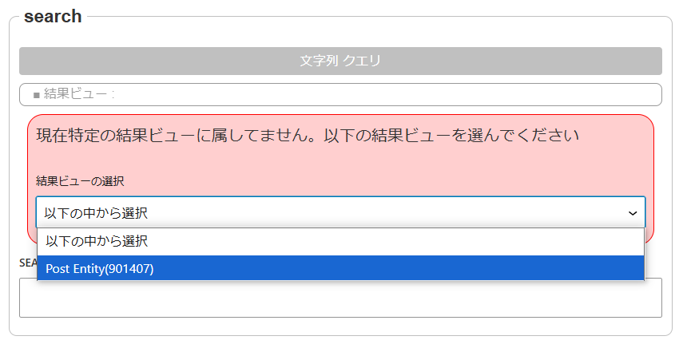


The query form is completed.


However, there are two query names (search).
Enter the value (hello) here.

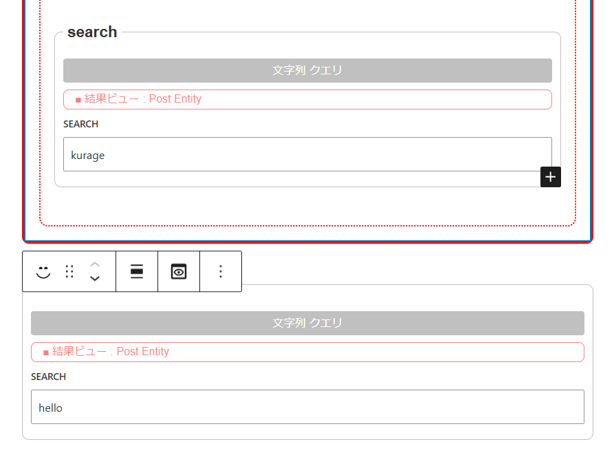


If you look at the query filter, "search" is now a radio button.
If there are multiple names for the same query parameter, you will need to choose one.
You can separate the search values ​​"kurage" and "hello".


## ID check

The query parameter "categories" is a search that narrows down the categories.
Search only for posts belonging to the specified category.

There are two ways to specify a post category.


* Specify an array of category IDs (categories)
* Specified by object (terms, include_children, operator)

The setting method is a little special.


Add a new results view.
The entity is a "category (taxonomy/category)".


A list of categories will be displayed in the DataGrid.
You can check each of them, so check them as appropriate.


## Multiple queries

Return to the post results view.
Add "categories" from the endpoint.

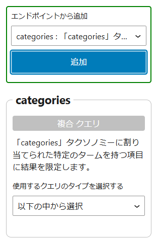


There are options to choose from.
These are "array queries" and "object queries."


* array query

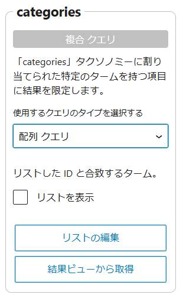

* Object query

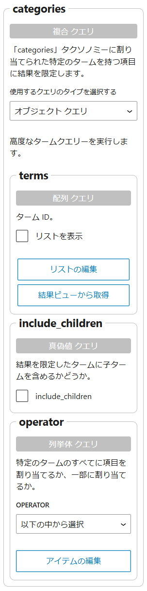


First, let's talk about array queries.
Press the "Get from results view" button.


Category Select a result view.


Overwrite the list.

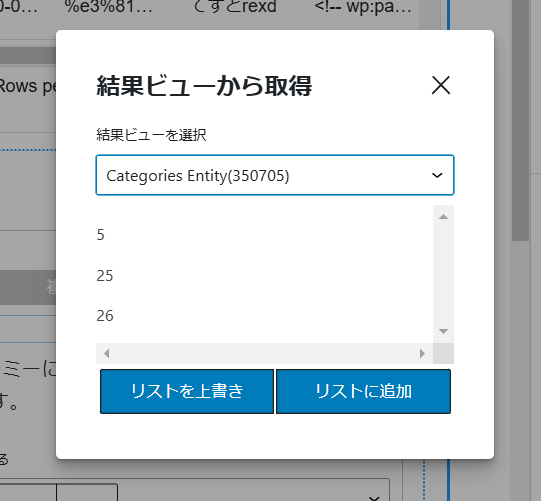


If you look at the query filter, you can see that the check items are specified as query parameters.


When you look at the results view, it's filtered to posts that belong to a specific category.
A category ID column has been added to make it easier to understand.

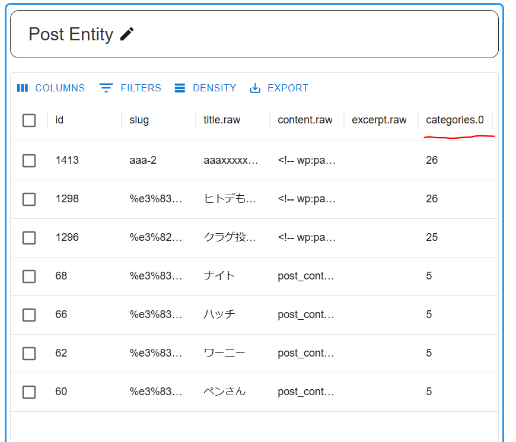


By the way, "object queries" are more complex.

* terms List of terms (unconfirmed, but may include terms other than categories?)
* include_children Include child terms?
* operator "AND" if it belongs to all terms, "OR" if it belongs to some terms

You can set these all at once.
Query parameters have become very complex.


## Meta check


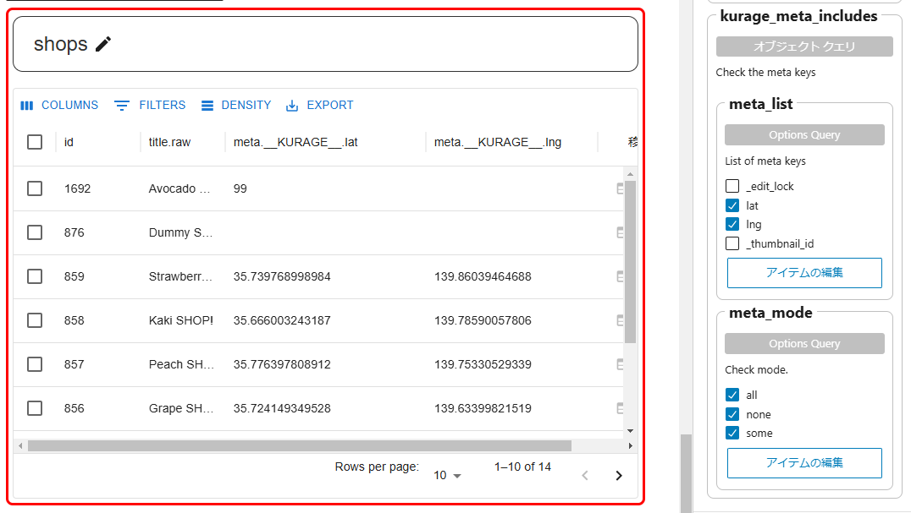


## others

You can move it by pressing the "Move to hidden block" button from the inspector.


You can change the border color and height of the results view

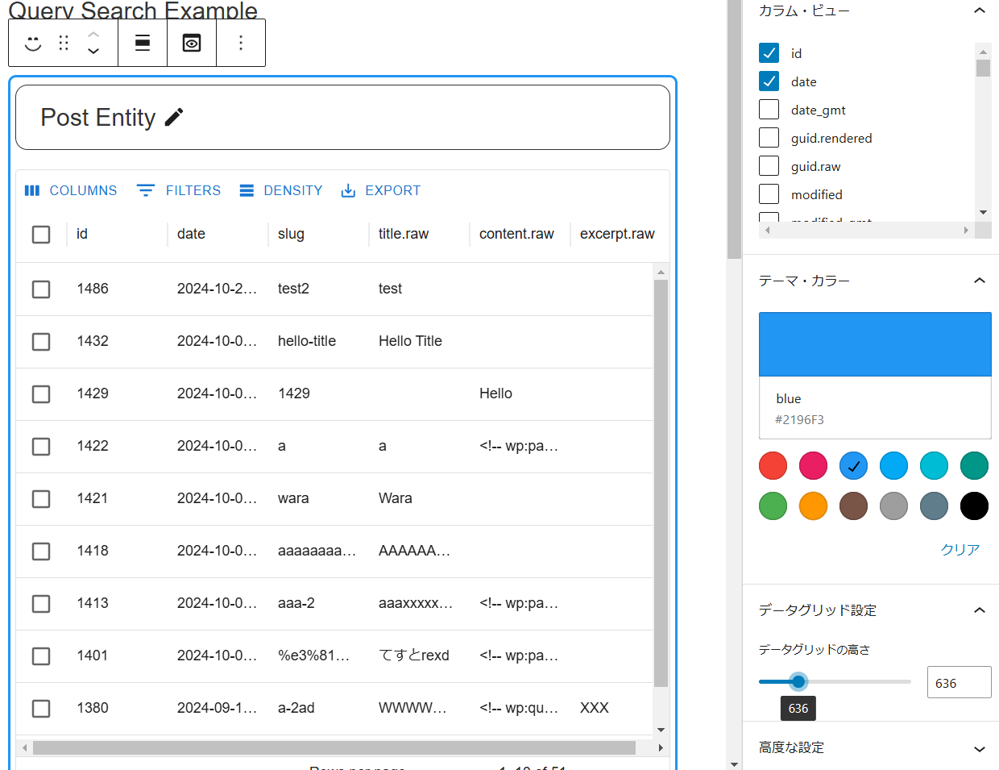

Check if the post has a meta.

Also check how many metas there are.

none: Contains no meta
all: includes all meta
some: between them.

For example, if there are three metas,
none: 0
all: 3
some: 1, 2


In this example, we have the coordinate values ​​lat, lng.

`none` indicates posts with no coordinates set,
`all` is the post where both are set,
`some` indicates posts where only one side is set.
Each is acquired using the "OR" condition.


## Not recommended for use during development

Features under development are disabled.
Click the button below to use that function.


The meaning of the icon is

You can move to, edit, or delete links to pages and edit pages.


This also automatically creates an edit form by parsing the JSON schema.

Press the plus icon to "add new" post (Entity).

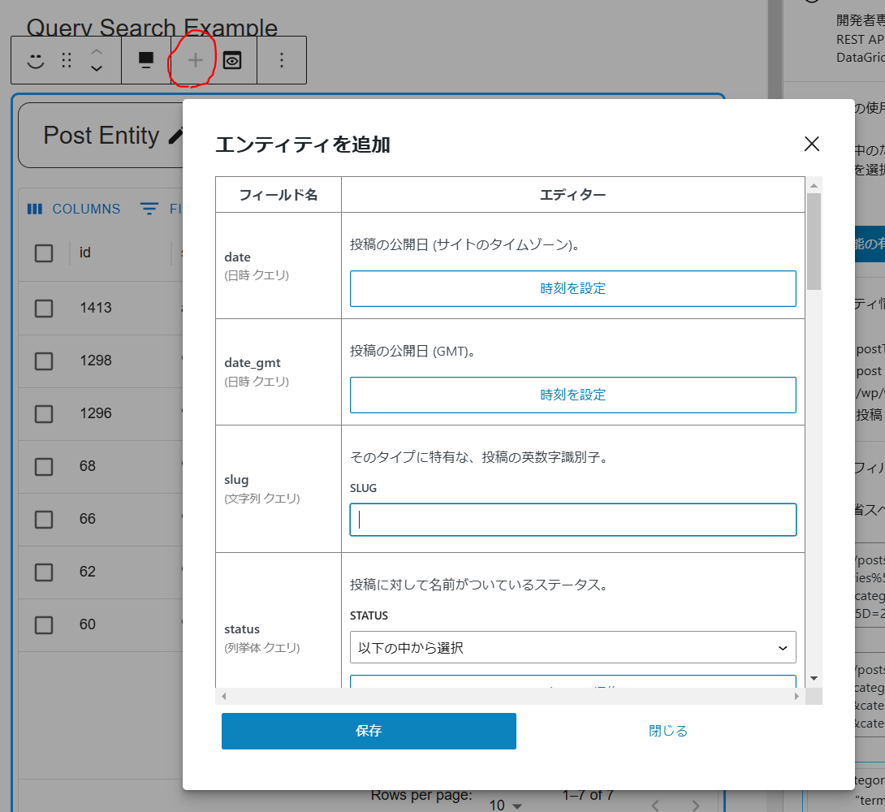


You can "update" the post (Entity) by pressing the pen icon.


These are under development, so their operation is unstable.
